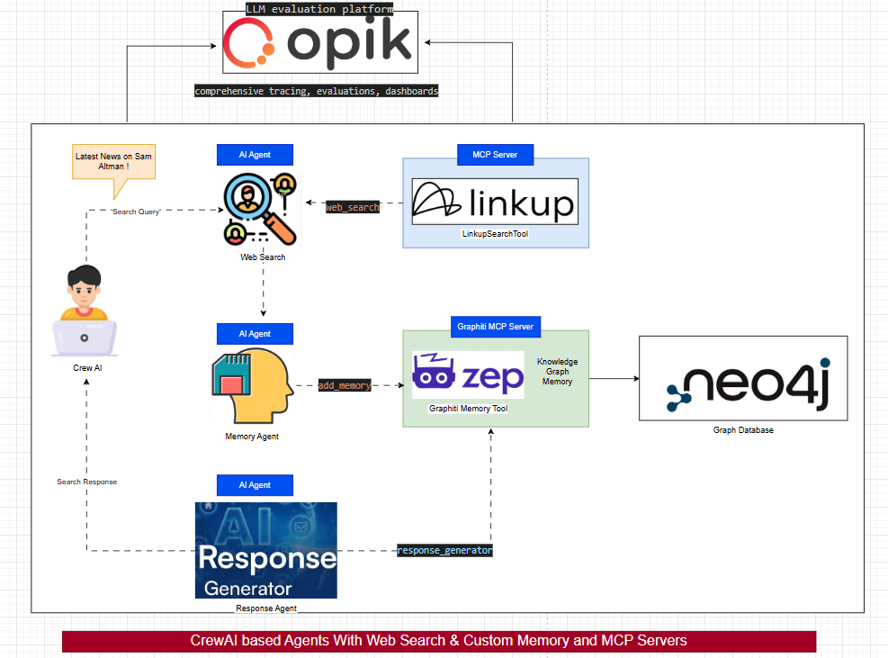

# CrewAI Agent Build Suite

## 1. File Structure

- **01_AIAgent1.ipynb**: Creating Agents, Defining Tasks, Orchestrating a Crew. Uses Local LLM Setup.
- **02_AIAgent1_Opik.ipynb**: Same as #1, but includes Opik for agent monitoring and evaluation.
- **03_AIAgent1_WithTool_LinkupWebSearch.ipynb**: Integrates LinkupSearchTool for contextual web search.
- **04_AIAgent1_WithMCP (Tool_LinkupWebSearch).ipynb**: Uses LinkupSearchTool via an MCP Server.
- **05_AIAgent2_With Memory.ipynb**: Adds memory to agents using Graphiti MCP Server (Zep's knowledge-based graph).
- **06_AIAgent2_ResetAgentMemory.ipynb**: Demonstrates memory reset and management.

## 2. About the Project

This suite demonstrates building, orchestrating, and extending AI agents using CrewAI, with local and cloud LLMs, web search tools, and persistent memory. It covers agent creation, task assignment, tool integration, and memory augmentation. Agent are powered by OpenAI or Local Ollama instance running the llama3.2 model

## 3. Required Installation

### Ollama (for Local LLM)
- Download: https://ollama.com/download
- Pull model: `ollama pull llama3.2`
- Run: `ollama run llama3.2`

### CrewAI
- Install: `pip install crewai`
- Docs: https://www.crewai.com/

### Opik (LLM Evaluation & Tracing)
- Install: `pip install opik`
- Configure: `opik configure` (enter API key from https://www.comet.com/account-settings/apiKeys)
- Docs: https://github.com/comet-ml/opik

### LinkupSearchTool (Web Search)
- Install SDK: `uv add linkup-sdk`
- Docs: https://docs.crewai.com/en/tools/search-research/linkupsearchtool
- Get API key: https://www.linkup.so/

### MCP Server (for Tool Integration)
- FastMCP: Python framework for MCP servers.
- Run: `python mcp_server_websearch.py`
- Check: http://localhost:8080/sse

### Graphiti MCP Server (Agent Memory)
- Clone: `git clone https://github.com/getzep/graphiti.git`
- Install: `uv sync`
- Requires: Python 3.10+, Neo4j (https://neo4j.com/download/)
- Configure `.env` with Neo4j and OpenAI API keys.
- Run Neo4j, then: `uv run graphiti_mcp_server.py --model gpt-4.1-mini --transport sse`
- Docs: https://help.getzep.com/graphiti

## 4. Key Concepts

### What is Ollama?
Ollama lets you run LLMs locally—no cloud dependency. Fast, private, customizable. Models: LLaMA, Mistral, Gemma, Phi-4, etc.

### What is CrewAI?
CrewAI orchestrates multi-agent AI systems. Modular, open-source, supports tool integration, and real-time protocols.

### What is Opik?
Open-source LLM evaluation platform. Provides tracing, dashboards, and guardrails for LLM-powered apps. Integrates with CrewAI for full traceability.

### What is LinkupSearchTool?
Integrates Linkup’s contextual information retrieval into CrewAI agents. Enables up-to-date, structured web search via API.

### What is an MCP Server?
Acts as a bridge between LLMs and external tools. FastMCP simplifies MCP server creation. Used here to expose LinkupSearchTool.

### What is Graphiti MCP Server (Zep’s Knowledge-Based Graph)?
Provides persistent, contextual, and semantic memory for agents. Built on Zep’s open-source graph engine. Integrates with Neo4j and OpenAI.

## 5. Agent Memory: Key Advantages
1. Context retention across tasks
2. Personalization & adaptability
3. Strategic planning & goal tracking
4. Collaborative intelligence
5. Reduced redundancy
6. Error correction & learning

## 6. Visuals & Diagrams

Below are key images and diagrams referenced in the documentation and notebooks:

For detailed step-by-step instructions, see the individual notebook files and the original markdowns.

## 7. Concepts in Depth

### Ollama (llama3.2 Model)
Ollama is a platform that allows you to run large language models (LLMs) locally on your machine, providing privacy, speed, and flexibility without relying on cloud services. The `llama3.2` model is a state-of-the-art open-source LLM from Meta, known for its strong performance in natural language understanding and generation tasks. Running `llama3.2` with Ollama enables you to:
- Avoid sending data to external servers, ensuring privacy
- Achieve low-latency responses for interactive applications
- Experiment with and fine-tune models locally

**How to use:**
- Download and install Ollama from https://ollama.com/download
- Pull the model: `ollama pull llama3.2`
- Start the model: `ollama run llama3.2`
- The local server will be available at http://localhost:11434/

**Links:**
- https://ollama.com/
- https://llama.meta.com/

### OpenAI
OpenAI provides powerful cloud-based LLMs such as GPT-3, GPT-3.5, and GPT-4, which are accessible via API. These models are widely used for a variety of natural language processing tasks, including text generation, summarization, translation, and more. In this project, OpenAI models can be used as an alternative to local LLMs for agent reasoning and task completion.

**Key Features:**
- Access to state-of-the-art language models via API
- High accuracy and broad general knowledge
- Scalable and easy to integrate into applications

**How to use:**
- Sign up at https://platform.openai.com/
- Obtain an API key from your account settings
- Set the API key in your environment (e.g., `OPENAI_API_KEY` in `.env`)
- Use the API in your code to interact with OpenAI models

**Links:**
- https://platform.openai.com/
- https://openai.com/research

### Opik
Opik is an open-source LLM evaluation and observability platform. It provides tracing, dashboards, and guardrails for LLM-powered applications. Opik integrates with frameworks like CrewAI to log traces for all agent activity, making it easier to debug, optimize, and monitor agent workflows. It offers features such as Opik Agent Optimizer and Opik Guardrails to improve and secure LLM applications in production. Opik can be used with Comet Cloud or self-hosted, and supports a wide range of integrations for tracing and evaluation.

**Key Features:**
- Comprehensive tracing and evaluation of LLM systems
- Dashboards for monitoring agent activity
- Guardrails for production safety
- Easy integration with CrewAI and other frameworks

**Links:**
- https://github.com/comet-ml/opik
- https://www.comet.com/docs/opik/

### LinkupSearchTool
LinkupSearchTool is a CrewAI tool that enables agents to perform contextual web searches using the Linkup API. Linkup is an AI search engine optimized for LLMs and agents, providing fast, accurate, and structured results. The tool allows agents to access up-to-date information from the internet, enhancing their ability to make informed decisions and complete tasks that require real-world knowledge.

**Key Features:**
- Seamless integration with CrewAI agents
- Access to Linkup’s contextual information retrieval
- Structured and sourced search results
- API key-based authentication

**Links:**
- https://docs.crewai.com/en/tools/search-research/linkupsearchtool
- https://www.linkup.so/

### FastMCP
FastMCP is a Python framework for building Model Context Protocol (MCP) servers. MCP servers act as bridges between LLMs and external tools or data sources, allowing agents to securely and reliably access functions and data outside their own context. FastMCP handles networking and protocol details, letting developers focus on tool logic. It is used here to expose the LinkupSearchTool as a service accessible by agents.

**Key Features:**
- Simplifies MCP server creation
- Handles protocol and networking
- Enables tool and data integration for LLMs

**Links:**
- https://github.com/crewAIInc/fastmcp

### Zep
Zep is a context engineering platform for AI agents, providing persistent, contextual, and semantic memory. Zep’s knowledge-based graph is built on top of Graphiti, enabling agents to remember, reason, and collaborate across sessions. Zep offers agent memory, Graph RAG for dynamic data, and context retrieval and assembly. It is tightly integrated with Graphiti and can be used as a memory layer for CrewAI agents.

**Key Features:**
- Persistent, temporally-aware memory for agents
- Semantic search and structured reasoning
- Graph-based context management

**Links:**
- https://www.getzep.com/
- https://help.getzep.com/graphiti

### Graphiti
Graphiti is Zep’s open-source graph engine for building and querying temporally-aware knowledge graphs. It is designed for AI agents operating in dynamic environments, supporting persistent memory, semantic search, and collaborative intelligence. Graphiti MCP Server exposes these capabilities via MCP, allowing agents to interact with knowledge graphs for memory and reasoning.

**Key Features:**
- Open-source knowledge graph engine
- Neo4j-based storage and querying
- MCP protocol support for agent integration

**Links:**
- https://github.com/getzep/graphiti
- https://help.getzep.com/graphiti/getting-started/mcp-server

### Neo4j Database
Neo4j is a leading graph database platform, used here as the backend for Graphiti and Zep’s knowledge-based graph. It enables efficient storage and querying of graph data, supporting features like semantic search, relationship tracking, and temporal queries. Neo4j Desktop provides a user-friendly interface for managing databases and visualizing graph data.

**Key Features:**
- High-performance graph database
- Supports complex queries and relationships
- Integrates with Graphiti and Zep for agent memory

**Links:**
- https://neo4j.com/

### CrewAI
CrewAI is a lightweight, open-source Python framework purpose-built for orchestrating AI agents that collaborate to solve complex tasks. 
Here implemented a FastMCP (Model Context Protocol) backbone that standardized how agents share context and knowledge. 
Each agent publishes its findings to shared knowledge graphs built on Neo4J, creating a persistent memory layer.

**Links:**
- https://www.crewai.com/

### Further Extension
This case study can be applied to Customer Onboarding Platform. Three specialized agents: a Research Agent for gathering customer context, an Analysis Agent for risk assessment, and a Communication Agent for personalized outreach.
