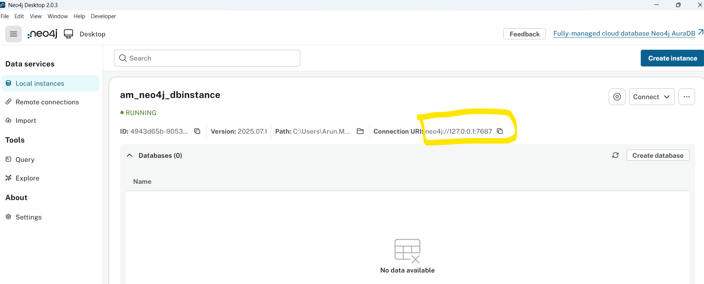
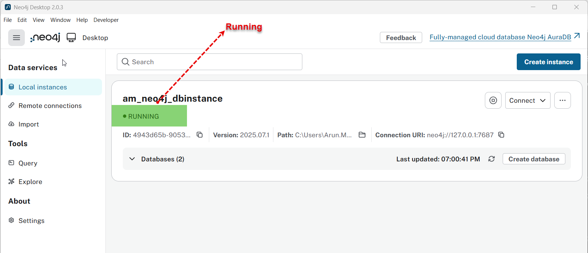
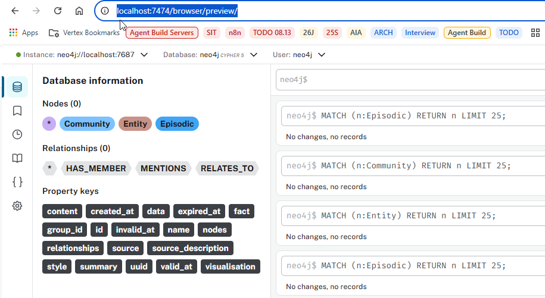
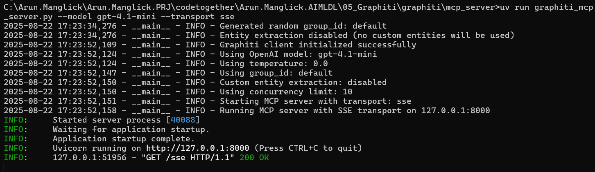
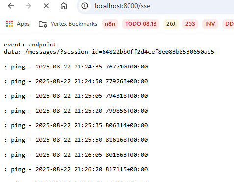
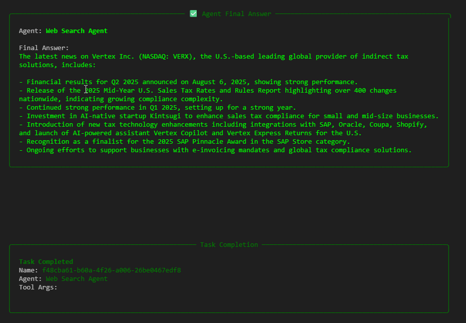
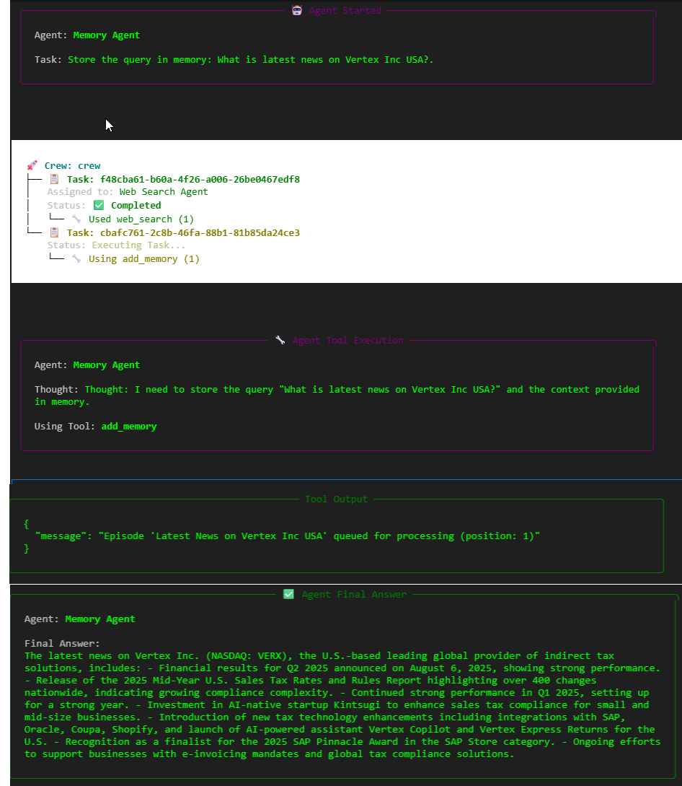
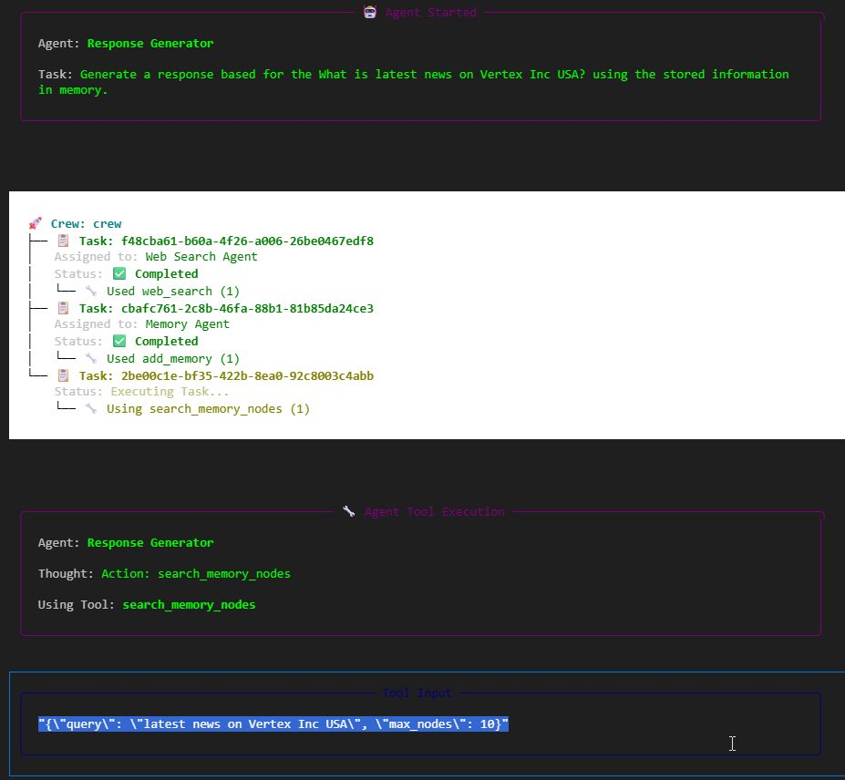
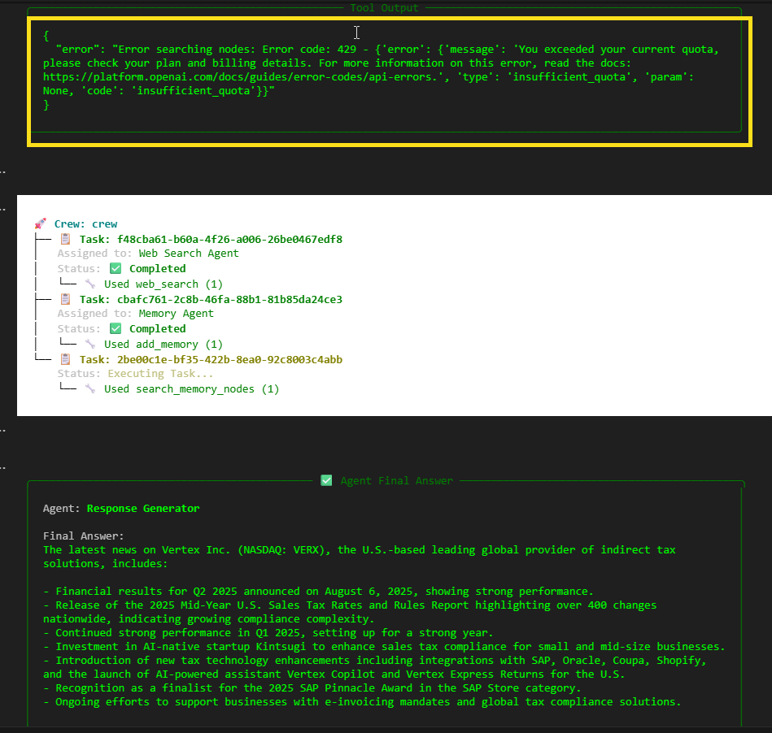
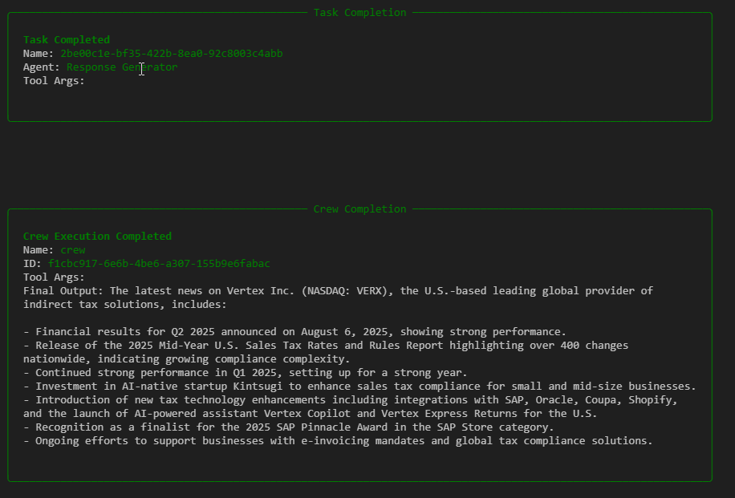

# About: 
This code is more towards adding human like memory to the agent.
Adding memory to an AI agent transforms it from a reactive tool into a strategic collaborator.

Here we'll be building
    1) Two more agent - Memory Agent and Response Generator Agent (Located in \04_Build_AI_Agents\02_Graphiti\graphiti\mcp_server\graphiti_mcp_server.py)
    2) One more MCP Server - Graphiti MCP Server (Zep’s open-source graph engine) (Read: Readme_05_GraphitiMCPServer.md)

# ----------------------------------------------------------------------------------------------

# 1) Memory Agent & MCP Server
 Memory Agent will take the query and respose generated by Agent1(LinkupSearch) and save in the memory using another MCP Server (Graphiti MCP Server)

# Note: Which Memory Tool is used (Zep’s knowledge-based graph)
This code is extending the Agents with knowledge graph memory.
The knowledge graph memory used is - Zep’s knowledge-based graph

# What is Zep’s knowledge-based graph (Built on top of Graphiti)
Zep’s knowledge-based graph is a cutting-edge, temporally-aware memory architecture designed to empower AI agents with persistent, contextual, and semantic understanding across interactions. 

https://help.getzep.com/graph-overview
https://github.com/getzep/graphiti
https://arxiv.org/abs/2501.13956

It’s built on top of Graphiti, Zep’s open-source graph engine, and is tightly integrated into Zep’s context engineering platform.
So here we are building Graphiti MCP Server which give agents persistent memory.

# Create Zep Account to use it
    Browse - https://www.getzep.com/
    Signup - Login using gmail (or anything else) (Used arunmanglickawsnew)  

# Graphiti (Zep’s open-source graph engine) MCP Server
Graphiti is a framework for building and querying temporally-aware knowledge graphs, specifically tailored for AI agents operating in dynamic environments
The Graphiti MCP Server is a powerful open-source framework that enables AI agents to interact with temporally-aware knowledge graphs memory tool (Zep) using MCP
It’s designed to give agents persistent memory, semantic reasoning, and collaborative intelligence across sessions—making it ideal for orchestrating multi-agent systems like CrewAI, Claude Desktop, or Cursor IDE.

Graphiti powers the core of Zep, a turn-key context engineering platform for AI Agents. Zep offers agent memory, Graph RAG for dynamic data, and context retrieval and assembly.

https://github.com/gifflet/graphiti-mcp-server
https://help.getzep.com/graphiti/getting-started/mcp-server

Features:
    1. Bridges AI agents with Neo4j-based knowledge graphs
    2. Exposes Graphiti’s capabilities via MCP, a standardized protocol for agent communication
    3. Supports persistent memory, semantic search, and structured reasoning

# ----------------------------------------------------------------------------------------------
# 2)  Graphiti MCP Server
  - Graphiti is a framework for building/querying temporally-aware knowledge graphs, specifically tailored for AI agents operating in dynamic environments
  - Here we are using Graphiti by Zep AI as a memory layer for an AI agent

# Graphiti MCP Server Set Up
    Follow these steps to set up the project before running the MCP server.
        Clone GitHub Repository
        git clone https://github.com/getzep/graphiti.git
        cd graphiti/mcp_server
    Install Dependencies
        uv sync

# Prerequisites Before Running MCP Server
    Ensure you have Python 3.10 or higher installed.
    A running Neo4j database (version 5.26 or later required)
    OpenAI API key for LLM operations

# Install Neo4j
    https://neo4j.com/download/
    The simplest way to install Neo4j is via Neo4j Desktop. It provides a user-friendly interface to manage Neo4j instances and databases
    

# Configuration
Before running the MCP server, required step is configure the environment variables. 
    Create .env file in the graphiti/mcp_server directory and add below content

    # Neo4j Database Configuration
    NEO4J_URI=bolt://localhost:7687
    NEO4J_USER=neo4j
    NEO4J_PASSWORD=demodemo

    # OpenAI API Configuration
    OPENAI_API_KEY=<your_openai_api_key>
    MODEL_NAME=gpt-4.1-mini

# Run Local Neo4j Instance
 Note: Before running MCP Server ensure your local Neo4j Database is in Running State
 

 You can also browse this here http://localhost:7474/browser/preview/
 

# Graphiti MCP Server
  This exists here (\04_Build_AI_Agents\02_Graphiti\graphiti\mcp_server\graphiti_mcp_server.py)
  This python file contains multiple MCP Server 
    - async def add_memory 
    - async def search_memory_nodes
    - async def search_memory_facts
    - async def delete_entity_edge
    - async def delete_episode
    - async def get_entity_edge
    - async def get_episodes
    - async def clear_graph
 
  Here (05_AIAgent2_With Memory.ipynb) code is using first two agents -  add_memory & search_memory_nodes

# Run Local Neo4j Instance
 Note: Before running MCP Server ensure your local Neo4j Database is in Running State
 

# Run Graphiti MCP Server
 - Go to Command prompt
 - cd path where mcp server file is available 
   C:\Arun.Manglick\Arun.Manglick.PRJ\codetogether\Arun.Manglick.AIMLDL\04_Build_AI_Agents\02_Graphiti\graphiti\mcp_server\
 - Run Command: uv run graphiti_mcp_server.py --model gpt-4.1-mini --transport sse
 

- Browse http://localhost:8000/sse

# Finally Run Your Crew AI Agent (05_AIAgent2_With Memory.ipynb)
C:\Arun.Manglick\Arun.Manglick.PRJ\codetogether\Arun.Manglick.AIMLDL\04_Build_AI_Agents\01_BasicAgent_CrewAI\05_AIAgent2_With Memory.ipynb

# ----------------------------------------------------------------------------------------------
Here is recorded final output of running three agents (web_search,add_memory, search_memory_nodes)

# ----------------------------------------------------------------------------------------------

# Key Advantages of Agent Memory
1. Context Retention Across Tasks - Agents can remember prior inputs, decisions, and outcomes. This enables continuity in multi-step workflows (e.g. portfolio rebalancing, SIP optimization, or regulatory simulations).
2. Personalization & Adaptability - Agents tailor responses based on user preferences, goals, and past interactions. Ideal for mentoring workflows or family wealth planning where context matters deeply.
3. Strategic Planning & Goal Tracking - Memory allows agents to track long-term objectives and adjust strategies dynamically. For example, your past receomendations in generting output etc.
4. Collaborative Intelligence - In CrewAI-style setups, agents with memory can share insights, delegate tasks, and refine outputs based on shared history. Think of it as squad-level situational awareness.
5. Reduced Redundancy - No need to re-specify constraints or preferences repeatedly. Agents can recall fund preferences, tax rules, or risk tolerances automatically.
6. Error Correction & Learning - Agents can learn from past mistakes or feedback loops. Useful for debugging workflows or refining investment strategies over time.