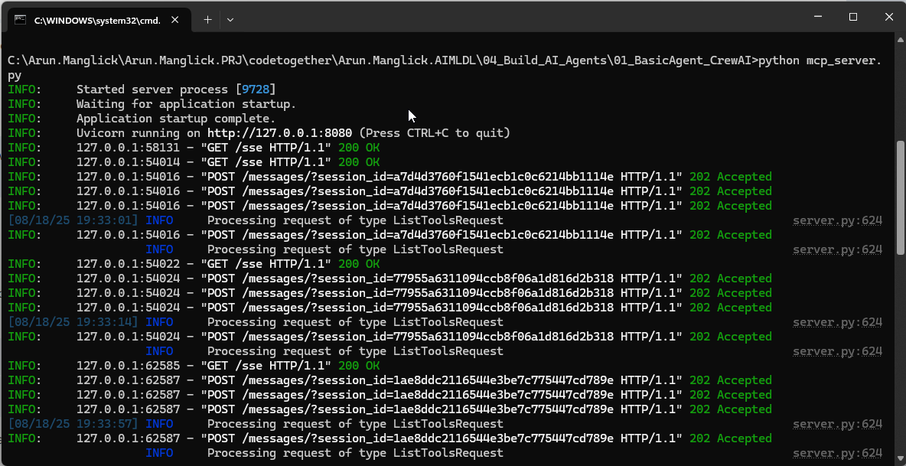
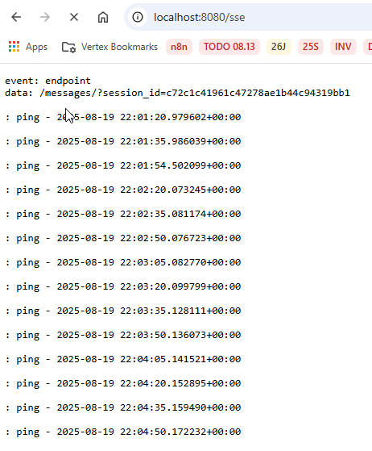

# About: 
This code is more towards using MCP Server
Here instead of using Linkup Search Tool local (03_AIAgent_WithTool_LinkupWebSearch.ipynb), it's exposed as MCP Server

#  MCP Server
Created mcp_server.py
Moved the code which usse Linkupclient to search the data in this file.

# How to run the MCP Server
Go to command prompt: python <folderpaht/filename.py>
python mcp_server.py

# Check in browser MCP Server is running
http://localhost:8080/sse

# Run the Agent
Once MCP Server is running, execute the agent codein python notebook

# Using OpenAPI instead of Local LLM using Olama
For this you are required to get an API key for OpenAI
Here's how to get your key:

    1. Sign In: Go to the OpenAI platform and sign in or create a new account. (Used Gmail - AWS)
       https://platform.openai.com/
    2. Navigate to API Keys: Once logged in, click on your profile icon in the top right corner and select "View API keys".
    3. Create a New Key: On the API keys page, click the "+ Create new secret key" button. Give your key a descriptive name.
    4. Copy the Key: A new key will be generated and displayed only once. Make sure to copy it immediately and save it in a secure location, such as in your project's .env file as OPENAI_API_KEY="your_secret_key_here".

# What is FastMCP
FastMCP is a Python framework that simplifies the creation of MCP (Model Context Protocol) servers.
FastMCP framework handles all the complex networking and protocol details behind the scenes, allowing you to focus on simply defining what your tool does.

# What is an MCP Server?
An MCP server is designed to act as a bridge between a large language model (LLM) and external systems or tools. Think of it like a universal adapter for AI. 
It allows an LLM, which might be running on a different machine or a different platform, to securely and reliably access functions and data that are outside of its own context.