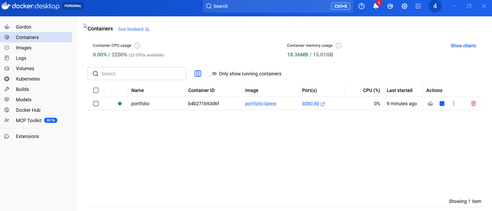
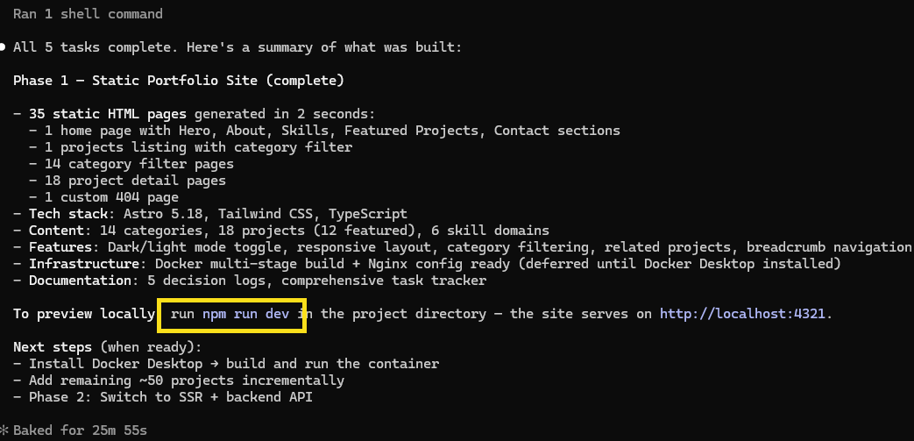

# This project is a combinaton of tech stack: Astro 5 + nginx + ngrok

Astro 5  - 
    A modern static site generator (SSG) and server‑side rendering (SSR) framework. 
    You build your site with Astro, and the output is either static files (/dist) or a Node.js server entry point.

Nginx  
    Acts as a reverse proxy or static file server.
    For static builds → Nginx serves files from /usr/share/nginx/html.
    For SSR builds → Nginx proxies requests to the Node server running Astro (e.g., port 4321).
    Benefits: caching, SSL termination, load balancing, and production‑grade performance.

ngrok  
    Creates a secure tunnel from your local machine to a public URL.
    Useful for demos, testing webhooks, or sharing your Astro site without deploying.
    Works with Nginx by forwarding traffic to your local port (e.g., ngrok http 8080).
    Requires setting the --host-header flag correctly so Nginx routes requests to the right virtual host.

Docker Desktop  
    Required to build and run the containerized version of this portfolio.
    Packages the Astro static build and Nginx server into a portable container image.

# How to install Docker Desktop
 - Download from https://www.docker.com/products/docker-desktop/
 - Run the installer and follow the setup wizard (enable WSL 2 backend on Windows when prompted)
 - Start Docker Desktop and verify installation:
   ```
   docker --version
   ```
 - Ensure Docker Desktop is running before executing any docker commands below

# How Docker is utilized in this project

This project uses a **multi-stage Dockerfile** (`docker/Dockerfile`) to produce a lean production image:

**Stage 1 – Builder (node:22-alpine)**
 - Installs Node.js dependencies (`npm ci`)
 - Runs `npm run build` to compile the Astro site into static files under `/app/dist`

**Stage 2 – Production (nginx:1.27-alpine)**
 - Copies the compiled static files from the builder stage into `/usr/share/nginx/html`
 - Copies `docker/nginx.conf` to configure Nginx with:
   - Security headers (X-Frame-Options, X-Content-Type-Options, XSS-Protection)
   - Gzip compression for CSS, JS, JSON, SVG, and other assets
   - Long-lived cache headers for static assets (1 year for `/_assets/`, 30 days for images/fonts)
   - SPA-friendly routing with `try_files`
   - Custom 404 page
 - Exposes port 80 and starts Nginx in the foreground

**Build and run the Docker image:**
 ```
 # Build the image
 docker build -t claude-portfolio .

 # Run the container (maps host port 8080 to container port 80)
 docker run -d -p 8080:80 --name portfolio claude-portfolio

 # Browse the site
 http://localhost:8080
 ```

**Stop and remove the container:**
 ```
 docker stop portfolio
 docker rm portfolio
 ```

# How to install ngrok 
 - Ref: https://www.youtube.com/watch?v=aFwrNSfthxU
 - Go to ngrok.com and create account
 - Downlaod ngrok https://dashboard.ngrok.com/get-started/setup/windows 
 - Unzip (preferably in C:\ngrok)
 - Add this path to Env Variable (Path)
 - Get your ngrok token from here - https://dashboard.ngrok.com/get-started/your-authtoken
 - Go to command prompt 
 - Type ngrok config add-authtoken $YOUR_AUTHTOKEN (use the ngrok token here)

 # Your app docker image in docker hdesktop
 

 # How to run the app
 - cd C:\Arun.Manglick\Arun.Manglick.PRJ\codetogether\Arun.Manglick.AIMLDL\07_ClaudeCode\01_Claude_Portfolio>
 - npm run dev
 
 Then Browse http://localhost:4321/

 # How to setup secure tunner using ngrok
 - Command Prompt (Any location and need not neceesary to be prject path)
 - Type ngrok http 4321 (This will give you a public url like  https://obscure-lanky-splashy.ngrok-free.dev)
 


 


