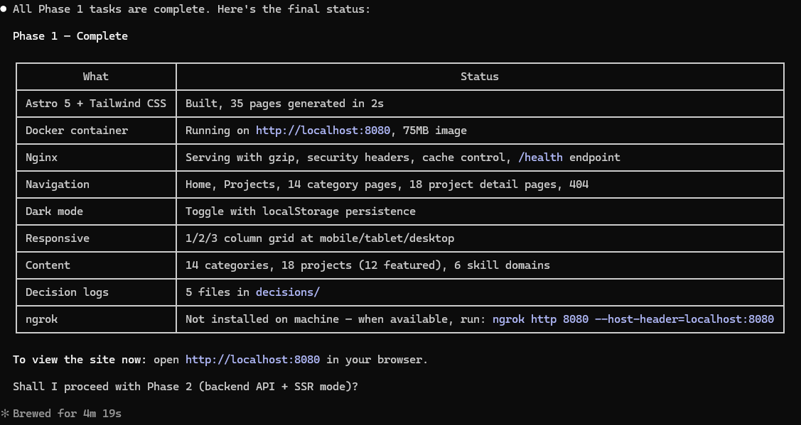

# Phase 1 Output — Static Portfolio Site

## Status: COMPLETE

Phase 1 has been fully implemented. The portfolio site is a static site built with Astro 5, styled with Tailwind CSS, containerized with Docker (multi-stage build), and served by Nginx.

---

## Build Summary

| Metric | Value |
|--------|-------|
| Total HTML pages generated | 66 |
| Total output files (dist/) | 82 |
| Project entries | 49 |
| Category entries | 14 |
| Build time | ~3.2s |
| Build errors | 0 |
| Docker image size | ~75 MB (nginx:1.27-alpine) |

---

## Tech Stack

| Layer | Technology | Version |
|-------|-----------|---------|
| Framework | Astro | 5.x |
| Styling | Tailwind CSS | 3.4.x |
| Font | Inter (self-hosted) | @fontsource/inter 5.x |
| Web Server | Nginx | 1.27-alpine |
| Container | Docker | Multi-stage build |
| Tunnel | ngrok | Pending installation |
| Language | TypeScript | Strict mode |

---

## File Structure Created

```
01_Claude_Portfolio/
├── astro.config.mjs              # Astro config (static output, Tailwind integration)
├── tailwind.config.mjs           # Dark mode (class), Inter font, primary color scale
├── tsconfig.json                 # TypeScript strict, @/* path alias
├── package.json                  # Dependencies and scripts
├── CLAUDE.md                     # Project instructions for Claude Code
├── portfolio_tasks.md            # Task tracking checklist
├── public/
│   └── favicon.svg               # Blue "AM" favicon
├── docker/
│   ├── Dockerfile                # Multi-stage: node:22-alpine → nginx:1.27-alpine
│   └── nginx.conf                # Gzip, security headers, immutable cache, /health
├── decisions/
│   ├── 001-framework-astro5.md
│   ├── 002-content-collections.md
│   ├── 003-tailwind-css.md
│   ├── 004-docker-multistage.md
│   └── 005-nginx-config.md
└── src/
    ├── content/
    │   ├── config.ts             # Collection schemas (Zod + glob loader)
    │   ├── categories/ (14 files)
    │   └── projects/ (49 files)
    ├── layouts/
    │   ├── BaseLayout.astro      # HTML shell, meta, OG tags, Inter font
    │   └── PageLayout.astro      # Header + content area + Footer
    ├── components/
    │   ├── global/
    │   │   ├── Header.astro      # Sticky nav, "AM" logo, theme toggle
    │   │   └── Footer.astro      # Copyright + GitHub link
    │   ├── home/
    │   │   ├── Hero.astro        # Full-width intro with CTA
    │   │   ├── About.astro       # Professional summary
    │   │   ├── SkillsGrid.astro  # 6 skill domains, responsive grid
    │   │   ├── FeaturedProjects.astro  # Top 6 featured projects
    │   │   └── ContactSection.astro    # GitHub + Email links
    │   └── projects/
    │       ├── ProjectCard.astro       # Card with tech badges, featured badge
    │       ├── CategoryFilter.astro    # Category buttons with active state
    │       ├── ProjectGrid.astro       # Responsive 1/2/3-column grid
    │       └── TechStack.astro         # Tech badges with "+N more" overflow
    ├── pages/
    │   ├── index.astro                 # Home page
    │   ├── 404.astro                   # Custom 404
    │   ├── projects/index.astro        # All projects listing
    │   ├── categories/[slug].astro     # Category-filtered view
    │   └── project/[slug].astro        # Project detail page
    ├── styles/
    │   └── global.css                  # Tailwind directives, CSS custom properties
    ├── data/
    │   └── skills.json                 # 6 domains with skill arrays
    └── utils/
        └── constants.ts               # Site metadata, URLs
```

---

## Pages Generated (66 total)

### Static Pages (3)
- `/` — Home page (Hero, About, Skills, Featured Projects, Contact)
- `/projects/` — All 49 projects with category filter
- `/404` — Custom error page

### Category Pages (14)
| Category | Slug | Projects |
|----------|------|----------|
| AI/ML & Deep Learning | `/categories/ai-ml-deep-learning/` | 11 |
| AWS Lambda | `/categories/aws-lambda/` | 9 |
| Java & Spring Boot | `/categories/java-spring-boot/` | 6 |
| React | `/categories/react/` | 3 |
| Node.js | `/categories/nodejs/` | 3 |
| CI/CD & Containers | `/categories/cicd-containers/` | 3 |
| Test Automation | `/categories/test-automation/` | 3 |
| Terraform | `/categories/terraform/` | 2 |
| Docker | `/categories/docker/` | 2 |
| Legacy .NET | `/categories/legacy-dotnet/` | 2 |
| AWS Certifications | `/categories/aws-certifications/` | 2 |
| Angular | `/categories/angular/` | 1 |
| Grafana | `/categories/grafana/` | 1 |
| Datadog | `/categories/datadog/` | 1 |

### Project Detail Pages (49)

**AI/ML & Deep Learning (11):**
1. CrewAI Multi-Agent Systems
2. Graphiti Knowledge Graphs
3. LangGraph Agent Workflows
4. Multi-Agent Orchestration System
5. AWS ML Specialty Prep
6. Jupyter Notebooks & Python ML
7. SOAP to REST Converter
8. N8N Workflow Agents
9. Claude URL Reducer
10. Robby Custom Agents
11. Custom Agent Framework

**AWS Lambda (9):**
1. Lambda DynamoDB CRUD
2. S3-to-Kinesis Streaming Pipeline
3. Lambda SES Email Service
4. AWS Lex Chatbot Handlers
5. Lambda Utility Scripts
6. Lambda SQL Connector
7. Kinesis Stream Processor
8. Lambda Parameter Store Reader
9. Lambda Thumbnail Generator

**Java & Spring Boot (6):**
1. Spring Boot REST API
2. Apache Camel Integration
3. Spring Boot Comprehensive Course
4. OpenAPI Spring Boot
5. Hazelcast Caching
6. Logback with Spring Boot

**React (3):**
1. React Applications Collection
2. React Full-Stack Events App
3. React Vite Starter

**Node.js (3):**
1. Node.js AWS Accelerators
2. Node.js Web Applications
3. Shopify AppRunner Research

**CI/CD & Containers (3):**
1. CI/CD with ECS Fargate
2. CI/CD ECR-ECS Pipeline
3. Docker Compose CI/CD

**Test Automation (3):**
1. Cypress E2E Testing
2. Cypress with TypeScript
3. REST Assured API Testing

**Terraform (2):**
1. Terraform Custom Modules
2. Terraform Udemy Course

**Docker (2):**
1. Node.js Docker Setup
2. Docker Compose Testing

**Legacy .NET (2):**
1. ASP.NET MVC & Web UI
2. WCF & Windows Services

**AWS Certifications (2):**
1. AWS Developer Associate Course
2. AWS ECS Course

**Angular (1):**
1. Angular & TypeScript Fundamentals

**Grafana (1):**
1. Grafana Monitoring Stack

**Datadog (1):**
1. Datadog Continuous Profiler

---

## Features Implemented

### Site Features
- **Dark/Light theme toggle** — persists via localStorage, respects `prefers-color-scheme`, survives Astro page transitions via `astro:after-swap` event
- **Responsive design** — mobile-first with breakpoints at sm (640px), md (768px), lg (1024px)
- **Category filtering** — server-side via static paths (no client-side JS)
- **Featured projects** — top 6 shown on home page
- **Related projects** — up to 3 same-category projects on detail pages
- **Tech stack badges** — with configurable limit and "+N more" overflow
- **Breadcrumb navigation** — Home > Projects > Category > Project
- **Status badges** — active (green), learning (yellow), archived (gray)
- **SEO meta tags** — title, description, OG tags per page

### Infrastructure
- **Multi-stage Docker build** — node:22-alpine builder, nginx:1.27-alpine runtime (~75 MB)
- **Nginx configuration** — gzip compression, security headers (X-Frame-Options, X-Content-Type-Options, X-XSS-Protection, Referrer-Policy), immutable caching for `/_assets/`, 30-day cache for static assets, custom 404, `/health` endpoint
- **Decision logs** — 5 architectural decisions documented

---

## Key Technical Decisions & Lessons Learned

### Astro 5 Content Collections
- **glob loader required**: Astro 5 uses explicit `loader: glob({...})` instead of the Astro 4 `type: 'content'` shorthand
- **slug handling**: The glob loader extracts `slug` from frontmatter to use as the entry `id`, then removes it before Zod validation. The `slug` field must NOT be in the Zod schema — use `entry.id` instead of `entry.data.slug`
- **Custom generateId**: `generateId: ({ entry }) => entry.replace(/\.md$/, '')` strips `.md` from entry IDs to produce clean URLs
- **Render API**: Use `import { render } from 'astro:content'` + `await render(entry)`, not the Astro 4 `entry.render()` method

### Docker on Windows
- Docker Desktop PATH requires explicit setup: `C:\Program Files\Docker\Docker\resources\bin\docker.exe`
- Credential helper needs PATH update: `$env:PATH = "C:\Program Files\Docker\Docker\resources\bin;$env:PATH"`

---

## How to Run

```bash
# Development (hot reload)
npm run dev                    # http://localhost:4321

# Production build
npm run build                  # outputs to ./dist

# Preview production build
npm run preview                # http://localhost:4321

# Docker (when available)
docker build -f docker/Dockerfile -t portfolio:latest .
docker run -p 8080:80 portfolio:latest    # http://localhost:8080

# ngrok tunnel (when installed)
ngrok http 8080 --host-header=localhost:8080
```

---

## What's Next — Phase 2 (Pending User Approval)

Phase 2 introduces a backend API and switches Astro to SSR mode:
- Node.js API (Express/Fastify) with GitHub API integration
- `output: 'server'` + `@astrojs/node` adapter
- Nginx reverse proxy for API and Astro
- `docker-compose.yml` for multi-service orchestration
- Live GitHub data (READMEs, commit dates) with caching

## Phase 1 Output
