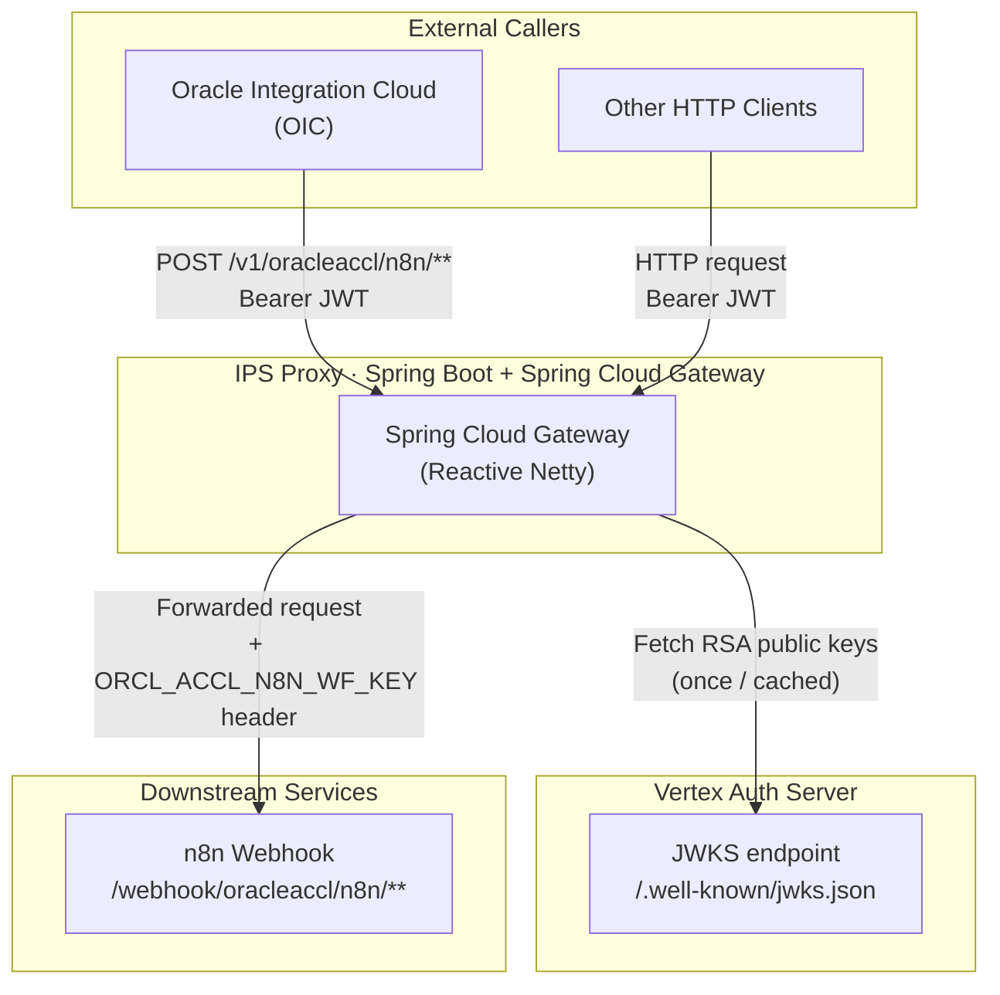
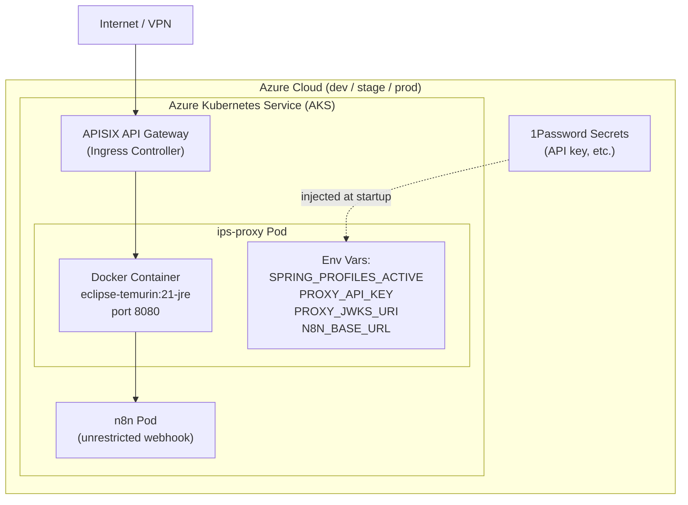
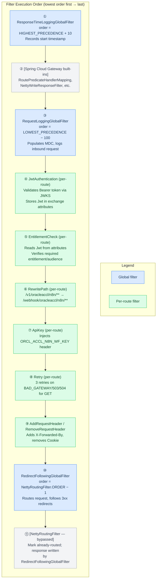
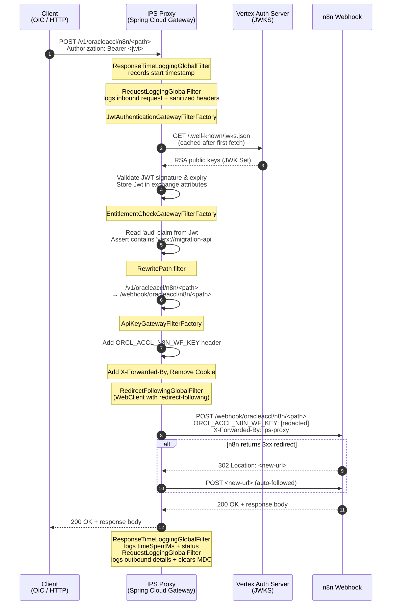
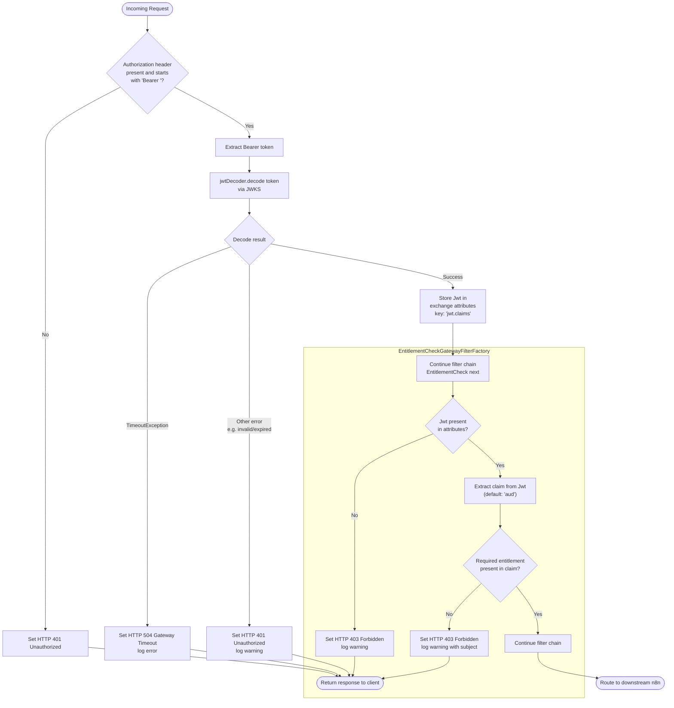
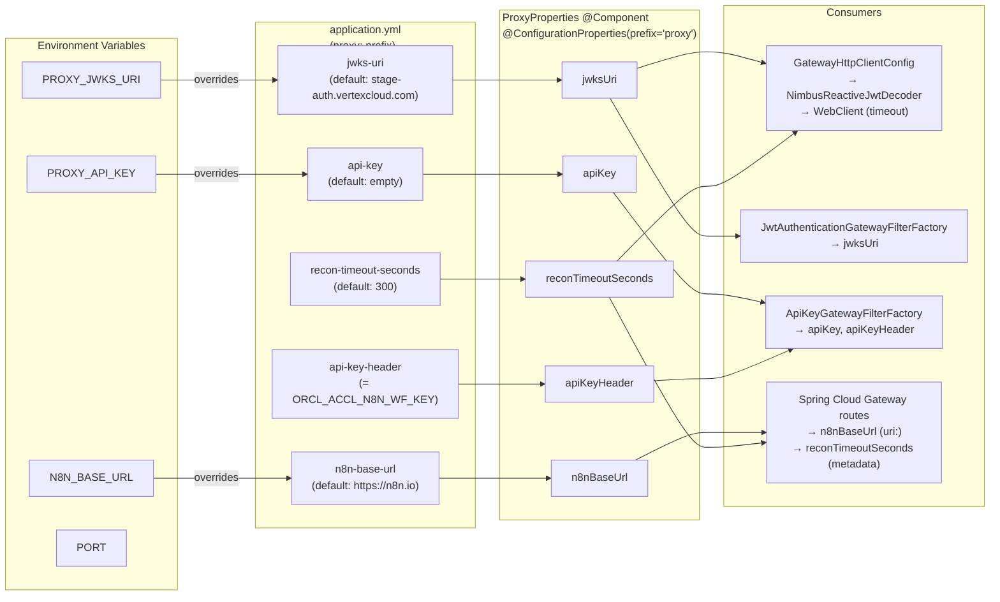

# IPS Proxy — Design Documentation

This document contains High-Level Design (HLD) and Low-Level Design (LLD) diagrams for the `ips-proxy` service, generated from the `develop` branch codebase.

---

## Table of Contents

1. [High-Level Design](#high-level-design)
   - [System Context](#1-system-context)
   - [Deployment Architecture](#2-deployment-architecture)
2. [Low-Level Design](#low-level-design)
   - [Component & Class Diagram](#3-component--class-diagram)
   - [Filter Chain Execution Order](#4-filter-chain-execution-order)
   - [Request Processing — Happy Path](#5-request-processing--happy-path)
   - [JWT Authentication Flow](#6-jwt-authentication-flow)
   - [Configuration Properties](#7-configuration-properties)

---

## High-Level Design

### 1. System Context

The IPS Proxy sits between external callers (e.g. Oracle Integration Cloud) and the downstream n8n workflow automation platform. It enforces authentication, entitlement checking, API-key injection, and request routing.



---

### 2. Deployment Architecture

The proxy is containerised and deployed to Azure Kubernetes Service via a shared Helm chart. APISIX acts as the public-facing API Gateway / Ingress.



**Environments and hostnames:**

| Profile | Hostname | Ingress |
|---------|----------|---------|
| `dev` | `ips-proxy-dev.dev.az.vtxdev.net` | Private (VPN) |
| `stage` | `ips-proxy.stage.az.vtxdev.net` | Public |
| `stage` (central) | `ips-proxy-centralus.stage.az.vtxdev.net` | Public |
| `prod` | `n8n.vertexcloud.com` (n8n) | — |

---

## Low-Level Design

### 3. Component & Class Diagram

```mermaid
classDiagram
    direction TB

    class IpsProxyApplication {
        +main(args: String[]) void
    }

    class ProxyProperties {
        -jwksUri: String
        -apiKey: String
        -apiKeyHeader: String
        -n8nBaseUrl: String
        -reconTimeoutSeconds: long
        +getJwksUri() String
        +getApiKey() String
        +getApiKeyHeader() String
        +getN8nBaseUrl() String
        +getReconTimeoutSeconds() long
    }

    class GatewayHttpClientConfig {
        +redirectFollowingWebClient(ProxyProperties) WebClient
        +jwtDecoder(ProxyProperties) NimbusReactiveJwtDecoder
    }

    class JwtAuthenticationGatewayFilterFactory {
        +CLAIMS_ATTR: String = "jwt.claims"
        -jwtDecoder: ReactiveJwtDecoder
        +apply(Config) GatewayFilter
        -unauthorized(exchange) Mono~Void~
    }
    class JwtAuthConfig["JwtAuthenticationGatewayFilterFactory.Config"] {
        (no fields — marker class)
    }

    class EntitlementCheckGatewayFilterFactory {
        +apply(Config) GatewayFilter
        -extractEntitlements(Jwt, String) Collection
        -forbidden(exchange) Mono~Void~
    }
    class EntitlementConfig["EntitlementCheckGatewayFilterFactory.Config"] {
        -requiredEntitlement: String
        -claimsKey: String
    }

    class ApiKeyGatewayFilterFactory {
        -props: ProxyProperties
        +apply(Config) GatewayFilter
    }
    class ApiKeyConfig["ApiKeyGatewayFilterFactory.Config"] {
        (no fields — marker class)
    }

    class RedirectFollowingGlobalFilter {
        -webClient: WebClient
        +getOrder() int
        +filter(exchange, chain) Mono~Void~
        -getRouteTimeout(exchange) Duration
    }

    class RequestLoggingGlobalFilter {
        +getOrder() int
        +filter(exchange, chain) Mono~Void~
        -populateMdc(exchange) void
        -logInboundRequest(exchange) void
        -logOutboundDetails(exchange) void
        -sanitizeHeaders(HttpHeaders) HttpHeaders
    }

    class ResponseTimeLoggingGlobalFilter {
        +getOrder() int
        +filter(exchange, chain) Mono~Void~
        -logTiming(exchange) void
    }

    IpsProxyApplication ..> GatewayHttpClientConfig : bootstraps
    GatewayHttpClientConfig --> ProxyProperties : reads
    GatewayHttpClientConfig ..> JwtAuthenticationGatewayFilterFactory : provides NimbusJwtDecoder
    GatewayHttpClientConfig ..> RedirectFollowingGlobalFilter : provides WebClient

    JwtAuthenticationGatewayFilterFactory +-- JwtAuthConfig
    EntitlementCheckGatewayFilterFactory +-- EntitlementConfig
    ApiKeyGatewayFilterFactory +-- ApiKeyConfig

    ApiKeyGatewayFilterFactory --> ProxyProperties : reads apiKey/apiKeyHeader
    EntitlementCheckGatewayFilterFactory ..> JwtAuthenticationGatewayFilterFactory : reads CLAIMS_ATTR
    RequestLoggingGlobalFilter ..> JwtAuthenticationGatewayFilterFactory : reads CLAIMS_ATTR
```

---

### 4. Filter Chain Execution Order

Spring Cloud Gateway processes filters in `order` value sequence. Lower numbers run earlier. Global filters run on every request; per-route filters apply only to matched routes.



---

### 5. Request Processing — Happy Path

End-to-end sequence for a successful `POST /v1/oracleaccl/n8n/<path>` request.



---

### 6. JWT Authentication Flow

Detailed flow inside `JwtAuthenticationGatewayFilterFactory` showing error paths.



---

### 7. Configuration Properties

How `ProxyProperties` is bound from environment variables and `application.yml` across deployment profiles.



**Profile-specific defaults:**

| Property | `dev` | `qa` | `stage` | `prod` |
|----------|-------|------|---------|--------|
| `jwks-uri` | `dev-auth.vertexcloud.com` | `qa-auth.vertexcloud.com` | `stage-auth.vertexcloud.com` | `auth.vertexcloud.com` |
| `n8n-base-url` | `amp-n8n-unrestricted-webhook.dev.az.vtxdev.net` | `amp-n8n-unrestricted-webhook.qz.az.vtxdev.net` ¹ | `amp-n8n-unrestricted-webhook.stage.az.vtxdev.net` | `n8n.vertexcloud.com` |
| `api-key` | _(empty)_ | _(from env var)_ | _(from env var)_ | _(from env var)_ |
| Log level | `INFO` | `INFO` | `INFO` | `WARN` |

> ¹ The QA n8n base URL uses the `qz` subdomain (not `qa`) — this matches the value defined in `application.yml` and is intentional.